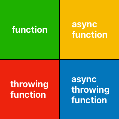

# Decoloring the network

## Existing Option #1 (async / await):
Raises "Unhandled Promise Rejection" on error

    const response = await fetch(url, request);

## Existing Option #2 (Promise / then / catch): 
Covers all cases, but can lead to callback pyramids

    fetch(url, request).then((response) => {
        // Handle success
    }).catch((reason) => {
        // Handle failure
    })

## Proposed Option #3 (myFetch):
Removes the "throwing" colors, but sync / async are still present.

    export const myFetch = async (url: string, init?: RequestInit | undefined): Promise<NETResponse> => {
        // Roll errors into "successful failure"
    }
 
## Proposed Option #4 (request / listen):
Covers all cases, fully disconnects UI from network

    type RequestID = number
    type ListenerID = number

    export type DataName = "sessionData" | "error"; // etc...

    export const startRequest = (url: string, init?: RequestInit | undefined): RequestID => {
        // Start a request object
        // Add to process table
        // Return RequestID
    }

    export const stopRequest = (id: RequestID): void => {
        // Find process in table
        // Abort request object
    }

    export const addListener(pattern: RequestID | DataName, handler: (response: NETResponse) => void): ListenerID => {
        // Add to listener table
        // Optional: immediately fire handler with current cached data
        // Return ListenerID
    }

    export const removeListener(id: ListenerID): void => {
        // Remove listener from table
    }

# Abstracting Other Concerns

## Environment

Subaru has:

- Environments ("cloudqa" | "cloudprod" | "clouddr") 
- Developer machines on localhost (at various ports)
- Demo mode (returns mock payloads)

Routing requests (or in the case of demo, reading json) should be handled in myFetch(...) or startRequest(...), not the individual endpoints.

## Reducing traffic

Some requests should have an immediate return on the following cases:

- Read from mock payloads **with a config option for a timed / random delay**
- Cache policy from:
    - A response header
    - A standardized location in the response payload
    - A per-endpoint configuration stored in the CMS
- Throttling based on:
    - Server response
    - Error handling: **if a service comes down, we want to limit flooding when it comes back up**
    - User interaction: **accidental multiple event sends should not result in multiple requests**

